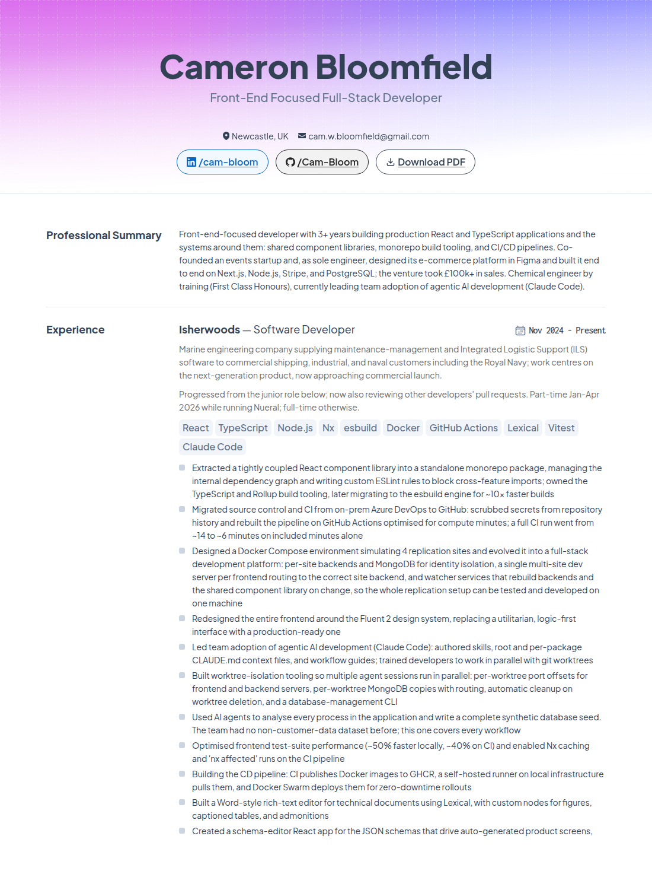

# cameronbloomfield.dev

Personal site and CV for Cameron Bloomfield, live at [cameronbloomfield.dev](https://cameronbloomfield.dev). The designed web CV pairs application-CV highlights with expandable technical detail.



- **Stack:** Next.js (App Router), React, TypeScript, Tailwind CSS v4. Fully static, deployed on Vercel.
- **Design source:** the CV Figma file. Colours, type, spacing, and icons are taken from it; the A4 design is rendered at 2x for the web.
- **Content:** `content/cv.ts` is the single source of truth for web CV copy and metadata. Role `bullets` hold the application-CV highlights; optional `details` appear in native, keyboard-accessible disclosures. Browser printing shows the highlights and omits those disclosures.
- **PDF:** the final two-page application CV lives at `public/Cameron-Bloomfield-CV.pdf` and is served from `/Cameron-Bloomfield-CV.pdf`. It is a separately authored document; replace this file when a new application CV is approved.

## Develop

```sh
pnpm install
pnpm dev        # http://localhost:3000
pnpm check      # lint, typecheck, format check
pnpm build      # production build
```

## Layout

```
app/            routes, metadata routes (OG image, icons, robots, sitemap), global CSS and tokens
components/cv/  the CV: header, sections, roles, education, skills
components/     shared icons (exported from Figma)
content/        CV data
lib/            site config, date formatting, OG helpers
assets/fonts/   static font instances used only for build-time image generation
public/         the PDF and other static files
```
